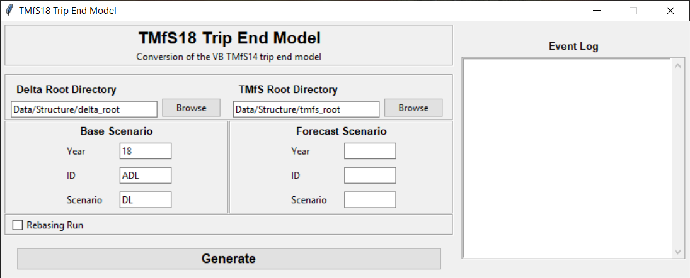

# TMfS18 Trip End Model

This is the first stage of the trip end model for TMfS18. The process produces 
the underlying car and public transport travel demand inputs for the demand model 
including movements associated with airport zones.

## Usage
Unless developing the tool, using the bundled executable version of the model is
strongly recommended. The latest version should be downloaded from the 
[releases page](https://github.com/TransportScotland/tmfs18-trip-end-model/releases).

When run, this will look something like the following:

### Parameters
The set of parameters required for the Base and Forecast scenarios follow a 
similar pattern:

- _Year_ contains the modelled year, typically a two-digit representation - e.g. 
  18 for 2018
- _ID_
- _Scenario_ corresponds to the TELMoS scenario, typically a two-letter 
  combination. 
  
In the case of _Year_ and _Scenario_, these should exactly match the folder and 
file names within __Delta Root__ for the required scenario.

### Folder Structure
The trip end model relies on defined folder structures. The following 2 
directories must be specified:

* Delta Root
* TMfS Root

#### Delta Root
Delta root contains sub-folders named after the scenario code with the TELMoS 
planning data within them. For scenario DL in 2018, for example, this would look
as follows:

* Delta Root
  * DL
    * tav_18DL.csv
    * tmfs_18DL.csv
    * trfl18DL.dat

#### TMfS Root
TMfS Root contains the 'Factors' folder and the 'Runs' folder. 'Factors' has the 
trip rates, area definitions, and growth rates required by the trip end model, 
including all the data files within the 'standard input' folder. 'Runs' contains 
the base year trip ends and the output from the trip end model. It has the 
following structure:

* TMfS Root
  * Factors
  * Runs
    * 18
        * Demand
            * ADL
    * 20 
        * Demand
            * BDL
