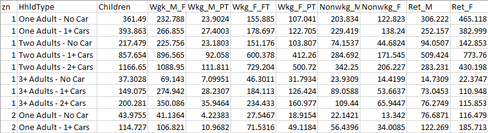
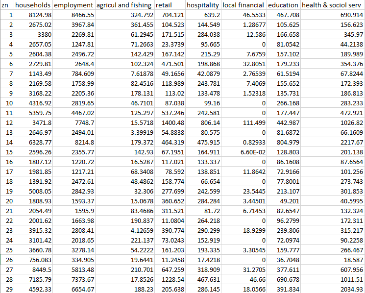
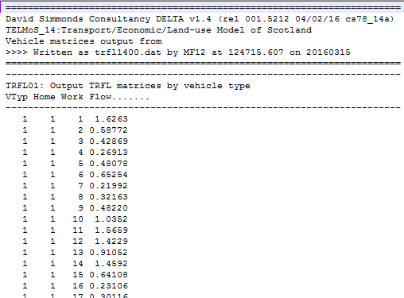

# Methodology

## Overview

The Trip End Model is an incremental model which pivots from files
prepared as part of the TMfS18 base year model. Therefore, the relevant
base year files must be accessible to operate the Trip End Model before
a new run of the Trip End Model can be undertaken.

Using this methodology, the trip end model acts entirely as a ratio
model. Growth rates for each modelled zone are calculated using a
combination of changes in planning data (number of households,
population and employment forecast over time) and a series of trip
rates. These rates of growth are then applied to TMfS base year trip
ends to create forecast year trip ends.

## Data Sources

The Trip End Model uses data from five main sources, namely:

-   Trip rate data from the UK Department for Transport (DfT) National Trip End Model (NTEM);
-   Output planning data from the Transport Economic Land-Use Model Of Scotland (TELMoS);
-   DfT Road Traffic Forecasts (RTF);
-   Rail growth factors, currently derived from TELMoS GVA forecasts; and
-   Airport growth data, for example from DfT aviation forecasts.

The use of these data sources in the trip end model are discussed in the 
following sections.

### National Trip End Model (NTEM)

The trip rates provided within the National Trip End Model (NTEM) form
an integral part of the DfT's National Transport Model (NTM) and TEMPRO.
There are three main components of the NTEM model, which have been
incorporated into the TMfS model, including:

1.  Household car ownership forecasting;
2.  A demographic model which allocates household and person type
    planning data to a system of 88 person-type categories; and
3.  Calculation of trip ends by applying trip rates to the number of
    persons in each of the 88 person-type categories

The NTEM trip rate structure is disaggregate and they are applied on a
zonal basis at the person trip making level within the trip end model.
These NTEM trip rates are also used within the TMfS Trip End Model.

The NTEM person type categories are split into a matrix of eleven person
types and eight household types generating 88 categories in total.

The eleven person types are:

- Children (0 to 15);
- males in full time employment (16 to 74);
- males in part time employment (16 to 74);
- male students (16 to 74);
- male not employed / students (16 to 74) - unemployed plus other inactive;
- male 75+;
- females in full time employment (16 to 74);
- females in part time employment (16 to 74);
- female students (16 to 74);
- female not employed / students (16 to 74) - unemployed plus other inactive; and
- female 75+.

The eight household types are:

- 1 adult household with no access to a Car;
- 1 adult household with access to one or more Cars;
- 2 adult households with no access to a Car;
- 2 adult households with access to one Car;
- 2 adult households with access to two or more Cars;
- 3+ adult households with no access to a Car;
- 3+ adult households with access to one Car; and
- 3+ adult households with access to two or more Cars.
    
The specific travel modes included in NTEM are:

- Walk;
- Cycle;
- Car driver;
- Car passenger;
- Bus; and
- Rail (including underground).

Note that the walk and cycle modes are not included within the TMfS18 Trip End Model.

Production trip rates for these 88 categories are obtained from the NTEM
using the input databases to the `CTRIPEND` software[^1]. The `IBETAhsr`
table was used to provide the weekly trip rates by purpose, traveller
type and area type. The table `IRHOmdhsr` was used to split these trip
rates by time period and mode.

Note that for the purposes of TMfS18, and TMfS14, each zone is assigned
a relevant NTEM "Area Type" in the `AreaCorrespondence.csv` input file.
This replaces the previous method where "Area Type 5" (Urban Medium) was
applied to all zones.

Trip rates are stored within a single file containing columns for each
segmentation available: purpose, mode, period, area type, traveller
type, and commute category (Working at Home - WAH and Working by
Commute - WBC).

This file storage method is a change from previous versions of the Trip
End Model, where separate files were used for each segmentation, and
should increase maintainability and clarity if these values need to be
altered in the future. The trip rate files are stored in the "Factors"
folder in the files `TripRates.csv` and `TripRatesSplit.csv`, for the
standard trip rates and the WAH/WBC split trip rates, respectively.

The car driver and car passenger rates are combined to produce car
person trip rates. Similarly, bus and rail trip rates are combined to
produce general public transport trip rates.

??? example "Example trip rate calculation"

    The relevant calculations applied for the trip rate for 
    _AM Peak Car, for a Male in Full time Work, from a 3 adults with 2+ car household_
    are illustrated below as an example of how these trip rates were
    calculated from the databases.

    - The weekly trip rate for a Male in Full time Work from a 3 adults with
      2+ car household (all modes, all week) is 4.081137 (from `IBETAhsr`)
    - The relevant mode splits for an (AM) Car Driver and an (AM) Car
      Passenger are 0.541076 and 0.042546, respectively (from `IRHOmdhsr`).
    - This creates a weekly AM car trip rate of $4.081137 * (0.541076 + 0.042546) = 2.38184$
    - A similar calculation is carried out for the PT trip rates using the
      bus and rail splits from `IRHOmdhsr`.

    For the WAH/WBC segmentation, the same operation is carried out for each
    segment using the relevant trip rates.

??? note "Alternative trip rate forecasts"

    At the time of writing (March 2023), Transport Scotland is considering 
    potential alternative forecast scenarios. Should alternative trip rates be
    required, these should still be generated with the same level of 
    granularity. 
    
    In particular, the DfT Trip Rate Forecasting Tool can produce output trip 
    rates in line with NTEM classifications, effectively creating a new 
    `IBETAhsr` table. Differences between these forecasts and the standard NTEM
    outputs will need to be considered when using these values as part of 
    calculations, and it may instead be advisable to use outputs solely to 
    inform changes over time (rather than as standalone trip rates).

### TELMoS Planning Data

To enable forecasting, the Trip End Model requires various planning data
which describes how the number of households, population and employment
located within each modelled zone may change over time. This data is
used to create growth factors for each modelled zone between the base
year and each forecast year scenario.

The planning data input to the Trip End Model is provided by the TELMoS
land‑use model. Examples of TELMoS outputs (and therefore inputs to the
Trip End Model) are described in the below sections.

#### Population Data
These files have the file naming convention of `tmfs{model year}{test id}.CSV`. 
These files contain the population data for each zone separated by eight 
household types and nine person types (note that the data excludes separate 
student population columns, as students are included in the "Non-Working"
section). Within the Trip End Model, the student data set is extracted
from the non-working column using a set of factors, which are 0.2794 for
Males and 0.2453 for Females[^2]. Once the student data is separated,
this generates the full 88 person type categories as described
previously.

An option has been added to the Trip End Model to allow population data
to be used that splits full-time and part-time workers into 2
categories, Working at Home and Working by Commute. This brings the
number of fields in the population data shown in the below image from 11 up to
15 (including zone and household type). If this format of population is
being used, the `TripRatesSplit.csv` file must be supplied, providing
trip rates for each working location segment - see previous section
"National Trip End Model (NTEM)" for details. If the population data is
being provided using this split, the suffix `_hw` (indicating
home-working splits) should be added to the file name for version
control, e.g. instead of `tmfs18XX.csv`, the file name would be
`tmfs18XX_hw.csv`.

#### Households and Employment Data
These files have the file naming convention of `tav\_{model year}{test id}.CSV`. 
These data files contain the total number of household and employment (jobs) for
each modelled zone. Employment data is further separated by employment
type, including agriculture and fishing, retail, hospitality, local
financial, education and health and social services. These separate
employment types allow the use of different trip attraction ratios
within the Trip End Model. It should be noted that the included
employment categories are not comprehensive and, therefore, do not equal
the total employment figures.

#### Goods Vehicle Data
These files have the file naming convention of `trfl{model year}{test id}.DAT`. 
These files represent a matrix of travel movements set out within a flat file 
format. The file contains four columns which represent:

- vehicle type (1=LGV, 2=OGV),
- origin zone, 
- destination zone, and 
- vehicle flow.

Note that within the file naming convention, "model year" refers to the
relevant base or forecast modelled year scenario. "Test id" represents
the TELMoS model test ID code.

### External Traffic Movements

DfT Road Traffic Forecast (RTF) data is used to create the future growth
in road travel movements for cars between the external areas of TMfS
(i.e. areas outside of Scotland). This includes external to external
trips, external to internal and vice-versa.

The 2018 RTF factors are shown below. They represent RTF Scenario 1
(Reference) for England and Wales[^3], which are rebased to 2015 and
interpolated for LATIS forecast years between the RTF 5-year intervals
(2015, 2020, 2025 etc up to 2050).

| Year | Car  |
|-----:|-----:|
| 2015 | 1.00 |
| 2018 | 1.04 |
| 2022 | 1.09 |
| 2027 | 1.14 |
| 2032 | 1.19 |
| 2037 | 1.23 |
| 2042 | 1.28 |

These growth factors are applied within a gravity model to forecast
changes in external travel movements over time. The base year external
trip ends (including external to internal and vice versa) are factored
using these growth values to create forecast year external trip ends.
These forecast trip ends are then applied to a gravity model (in tandem
with the base year matrices) to create forecast year external matrices.

The gravity model effectively applies a smoothing process to reduce the
level of inappropriate large cell-to-cell movements within these
matrices. A similar process is applied during the development of the
base year external travel demand.

### External Rail Movements

Factors associated with external rail trips are factored separately to
those of road traffic. The growth factors for rail trips are based on

-   forecast Scotland Gross Value Added (GVA) data from TELMoS; and
-   rail demand elasticity from the Passenger Demand Forecasting
    Handbook (PDFH) version 6.

To calculate the growth factors, the GVA growth was adjusted by an
elasticity of 1.1 from PDFH6 Table B2.3b, representing an elasticity
between the values for Non-London "between core cities" (1.25) and
"Other" (1.0). These growth factors are shown below for the key
LATIS forecast years.

| Year | Rail Demand Growth |
|-----:|-------------------:|
| 2018 | 1.000              |
| 2022 | 1.047              |
| 2027 | 1.134              |
| 2032 | 1.223              |
| 2037 | 1.306              |
| 2042 | 1.391              |

### Airport Related Travel Forecasts Growth Data

Surface access to Scottish Airports by car and public transport is
included within TMfS. The airport zones included in TMfS18 are displayed
below.

| Airport           | Zone |
|-------------------|-----:|
| Edinburgh Airport | 709  |
| Prestwick Airport | 710  |
| Glasgow Airport   | 711  |
| Aberdeen Airport  | 712  |

The growth factors for the airport zones are provided to the Trip End
Model in the `airport_factors.csv` file within the "Factors" folder.

Potential future changes to these types of travel movement can be
calculated using the UK Aviation Forecasts 2017 from the DfT[^4], which
present forecast passenger figures for UK airports from 2016 to 2050,
and have been used to prepare a set of growth factors.

The percentage annual growth for airport-related trips is applied
consistently to all car and public transport trip purposes.

## Model Application

### Car and Public Transport Trip Productions

Synthesised trip production vectors are created for the model base year
(pivot year) and each forecast year scenario by multiplying the trip
rates (calculated from NTEM) with the population planning data (output
from TELMoS). This forms a set of zone-based vectors for each travel
mode, purpose and person type for each year.

The synthesised forecast year vectors are then divided by the
synthesised base year vectors to prepare growth factors. These growth
factors are then applied to the calibrated TMfS18 base year trip ends to
prepare forecast year trip ends for input to the demand model. This
process can be described as:

$$P_{m,t,p}^{f} = \ P_{m,t,p}^{b}\ \frac{NTEM_{m,t,p}^{f}}{NTEM_{m,t,p}^{b}}$$

where:

- $P_{m,t,p}^{f}$ represents forecast year person trip productions by mode/Car
  availability `m`, time period `t`, and journey purpose `p`
- $P_{m,t,p}^{b}$ represents base year person trip productions by mode/Car
  availability `m`, time period `t`, and journey purpose `p`
- $NTEM_{m,t,p}^{f}$ represents forecast year person trip productions by
  mode/Car availability `m`, time period `t`, and journey purpose `p`,
  produced by NTEM model trip rates
- $NTEM_{m,t,p}^{b}$ represents base year person trip productions by mode/Car
  availability `m`, time period `t`, and journey purpose `p`, produced by NTEM
  trip rates

Initially, trip ends are generated for eight home-based journey
purposes, of which commute, employers-business and education trips are
applied directly within the TMfS demand model. The remaining five
purposes (shopping, personal business, recreation, visiting and holiday)
are combined to form the home-based other trip purpose, which is also
applied within the TMfS demand model.

Each journey purpose is then separated into the following car ownership
segments for input to the TMfS demand model:

- persons from non-car owning households;
- persons from single car owning households with 1 adult;
- persons from single car owning households with 2+ adults; and
- persons from multi car owning households.

The Morning Peak, Inter Peak and Evening Peak time periods in NTEM are
directly compatible with the TMfS time periods.

Note that the process above is used to generate trip productions for
from-home trip purposes for inclusion to the TMfS demand model. To-home
trips and non-homebased trip ends are created using a separate process
(based on these trip productions) within the demand model.

### Trip Attractions and Attraction Factors

The trip attraction process is a parallel procedure undertaken in tandem
with preparing trip productions. The Trip End Model includes separate
trip attractions for each journey purpose and time period. However,
attractions are in a more aggregate form with all household/car
ownership segments and travel modes combined.

#### Trip Attractions within the Demand Model

Within the demand model trip attractions fall into two distinct
categories:

- Trip attractions for home-based work (commute) which is a doubly
  constrained travel purpose in the destination choice model; and
- Trip attraction factors for home-based employer's business and
  home-based other, which are singly constrained travel purposes in
  the destination choice model.

Home-based work attractions represent actual trip attractions and act as
constraints within the destination choice process.

For the Home-based Employer's Business and Home-Based Other purposes,
however, attraction factors (attraction weightings) are applied. These
are used in tandem with generalised costs to distribute trips across
destinations. Therefore, there are no constraints for the actual trip
attractions to equal the attraction factors for each zone. This process
represents the specific HBE and HBO travel purposes which are singularly
constrained within the demand model.

The attraction factors for the base-year were calculated using an
iterative process. This involved successively adjusting attraction
factors and applying the singly constrained model until the resulting
actual trip attractions best matched those within the base matrices
(used in the destination choice model calibration).

#### Attraction Factors

The trip attraction factors applied in the Trip End Model are described
in the file `Attraction Factors.txt` in the "Factors" folder. The
attraction factors represent the relationship between different trip
purposes and different land use types. These data illustrate the number
of trips attracted to each type of job per week. For example, there are
(on average) 4,348 trips to school for each job in education.

The attraction factors, similar to the production trip rates, are
applied to the planning data for both the base (pivot) year and forecast
year scenarios. The resultant (synthesised) trip end vectors are then
used to produce growth factors, which are applied to the calibrated TMfS
trip end attractions. Consistent attraction growth factors are used for
all travel modes for each travel purpose.

Note that these factors are not applied to produce actual levels of trip
attractions. They are used to represent sectors that have different
factors, and as a result provide different attraction weightings for the
various land use types on a zonal basis.

Within the Trip End Model, the total level of trip productions is used
as a constraint to ensure that the total level of trip attractions match
total productions.

### Goods Vehicles

Goods vehicle trips are not subject to the core TMfS Demand Model
processes. Changes in goods vehicle trips over time are created within a
separate process. This applies a combination of TMfS base year goods
vehicles matrices and goods vehicle data extracted from the commodity
model within TELMoS. The resultant goods vehicle matrices are prepared
independently of the Demand Model for each future year and economic
growth scenario.

The base year goods vehicle matrices (formatted in Passenger Car Units -
PCUs) are described for each modelled hour (AM Peak, Inter Peak and PM
Peak) and by vehicle type, (LGV and HGV). The forecasting process
applied to these base matrices has the following four steps:

1. Calculate forecast year percentage growth on a trip end basis
   between TELMoS base year and forecast year matrices (these matrices
   cover internal goods vehicle movements within the TMfS modelled
   area);
2. Apply this percentage growth to the TMfS base year goods vehicle
   trip ends;
3. Apply NRTF growth to external zones; and
4. Input these trip ends, along with the base year matrices through a
   gravity model to produce smoothed forecast year matrices.

This process is applied to all TMfS18 goods vehicle trips including
cross-border movements.

### Education Matrices

The education travel matrices included within TMfS18 are input post the
main demand model stage. Within the Trip End Model, education-based trip
end files are created using a consistent process as applied for other
travel purposes. The forecast year education matrices are then created
by using these synthesised trip ends and the (calibrated) base (pivot)
year education matrices within a gravity model.

[^1]: CTRIPEND User Manual, Department for Transport, 2016.
[^2]: These factors were generated using population data from TELMoS
[^3]: Road Traffic Forecasts 2018, Department for Transport
[^4]: UK aviation forecasts 2017, Department for Transport