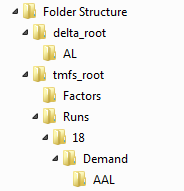
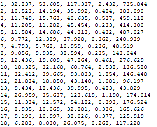
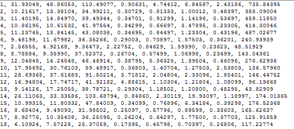
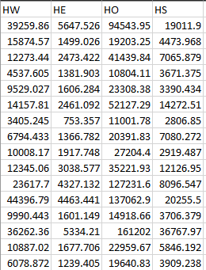
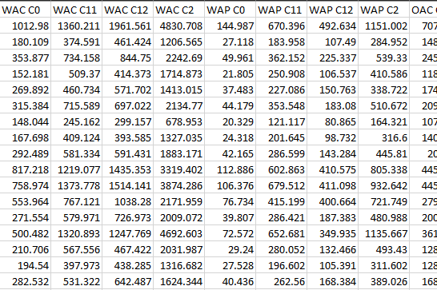
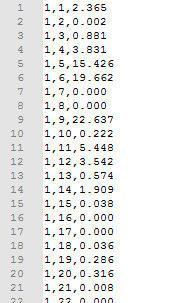
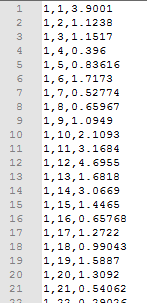
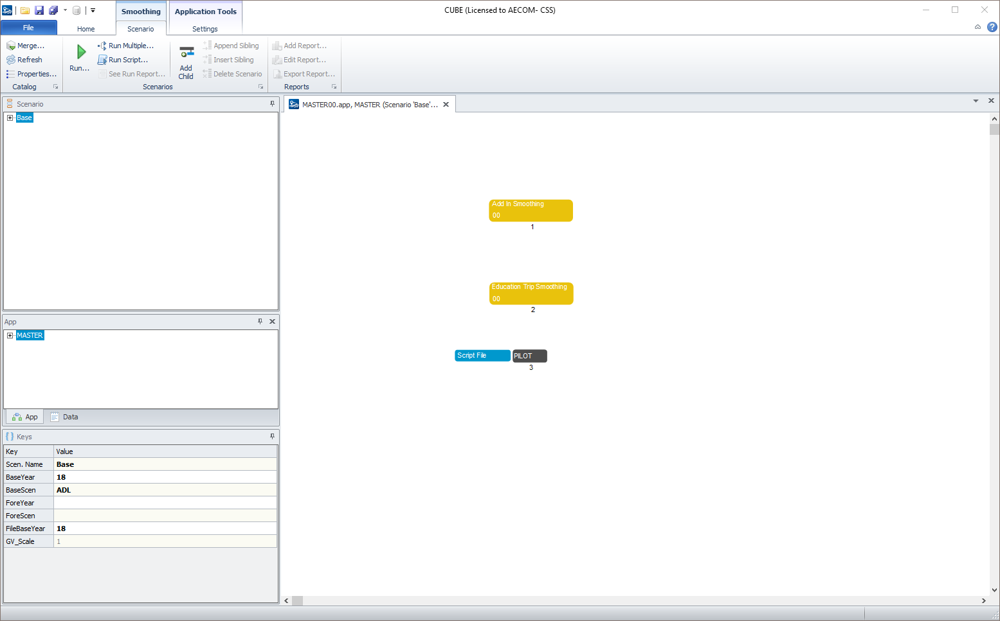
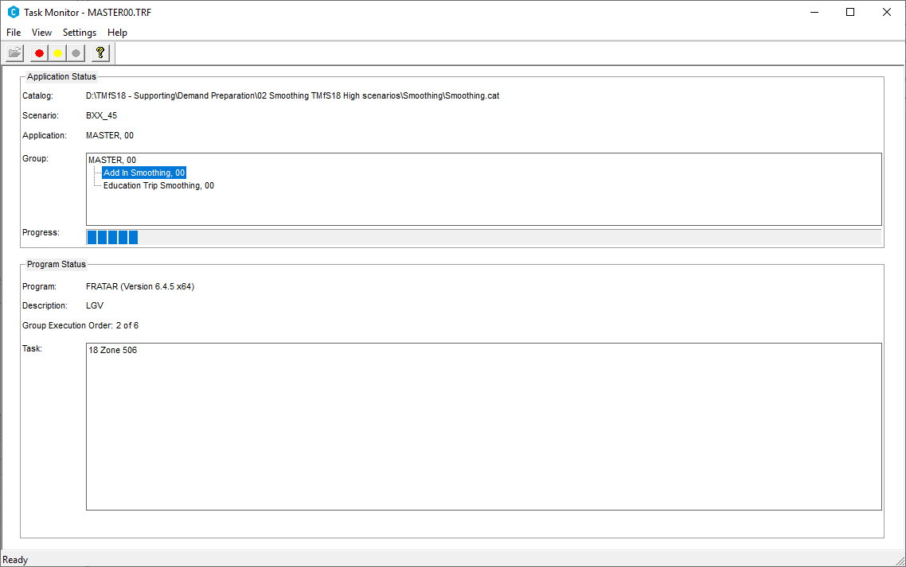

# User Guide

## Overview

The following sections describe how to operate the Trip End Model and
the relevant model directory structures.

## Input Data and Directory Structure

To generate new demands for use in TMfS, three distinct folders structures are 
required. The first is used to store the TMfS demands themselves and the second 
to store the files as provided from TELMoS. These, respectively, are referred 
to as `tmfs_root` and `delta_root` in this guide. The third folder is used to 
store the Factors files used by the trip-end model.

### `tmfs_root`
The Trip End Model files are located within various folders under a main
TMfS model directory. The PC will also need to have the correct version of Cube 
installed - this should be the same version used to run TMfS itself.

As the Trip End Model is an incremental model, it needs to pivot from
the existing run of the base year model and/or a previous forecast year
scenario. As a result, the base year files must exist on the PC running
the Trip End Model before a new forecast year run can be undertaken.
Therefore, the calibrated base year trip ends should be located in the
directory:

```
{tmfs_root}\Runs\{base_year}\Demand
```

where `base_year` for 2018 would be "18".

### `delta_root`
The Trip End Model uses various planning data and goods vehicle data
output from the TELMoS model. For each modelled year, three files are
required, including:

- `tav_{tel_year}{tel_scenario}.csv` - the household and employment
  data file;
- `tmfs{tel_year}{tel_scenario}[_hw].csv` - the population data
  file. The `_hw` suffix is added if the file is split by WAH/WBC; and
- `trfl{tel_year}{tel_scenario}.dat` - the goods vehicle data file.
  Where `tel_year` is the forecast year and `tel_scenario` is the
  TELMoS test scenario code, e.g. "AE" and "18" respectively.

For each new forecast year modelled scenario, a new folder should be
created in `delta_root`, named using the relevant TELMoS scenario code
(`tel_scenario`). The three files should be saved in the folder 
`{delta_root}\{tel_scenario}`.

### Factors
The remaining input data is contained within the "Factors" directory.
The files in this folder contain the trip rates and attraction factors
described previously. By default, this is assumed to be contained within 
`tmfs_root`, i.e. `{tmfs_root}\Factors`.

## Setting up the Model Run

If no previous model run of the Trip End Model has been undertaken for a
forecast year, a new folder should be created in
`{tmfs_root}\Runs\{tel_year}\{tel_scenario}`. Within this folder, a
further folder named "Demand" should also be created.

### Required Inputs
Now the directory structure is complete the model executable can be run.
This can be undertaken either using the executable GUI or through the
command line - via a batch file or other method. The executable has 
eight required arguments, as follows:

- Delta Root - path for the DELTA files;
- TMfS Root - path for the executable;
- Forecast Year - 2-digit year;
- Forecast TMfS Scenario - what the user is calling the demand
  scenario which is produced by this run of the Trip End Model;
- Forecast Year TELMoS scenario code;
- Base Year - the year used to pivot from
- Base TMfS Scenario Code - the demand model input set that is being
  pivoted from; and
- Base Year TELMoS Scenario Code - the planning data used to create
  the base scenario

### Optional Inputs
In addition to the required inputs, there are a series of optional inputs which
may need to be filled in depending on the scenario you are running. 

- Integrate Home Working - if selected, the population data and trip rate data 
  will be expected with the WAH/WBC split discussed in the 
  ["TELMoS Planning Data" section](./02_methodology.md#telmos-planning-data). Checked on by default;
- Use Old Trip Rate Format - Can be selected to use the previous format of 
  production trip rates (separate files for each segmentation containing a 
  matrix of trip rates by household/person type). Unchecked by default; and
- Trip Rate File/RTF/PTF/Airport Factors File - Alternative location for factor 
  files. If blank, this assumes the files can be found in `{tmfs_root}\Factors`
  with their default names.

### Running the Trip-End Model
Once the arguments have been entered, the model can be run. A model
run should typically take less than 5 minutes to complete for one
scenario.

## Trip End Outputs
A successful Trip End Model run will create the following output files:

- `*.TOD` / `*.CTE` files - nine of each, these are the trip end files for
  input to the demand model;
- `tav_{tel_year}_{tel_scenario}.csv`,
  `tmfs{tel_year}_{tel_scenario}.csv`, `lgv{tel_year}{tel_scenario}.dat` and
  `hgv{tel_year}{tel_scenario}.dat` - these are the files which are used for 
  future pivoting; and
- `*.DAT` and `*TE.DAT` - 36 files, these are files for each goods
  vehicle and add-in category for each time period.

The folder structure containing the various output files is shown below. 
The content of these folders are used to create trip ends for
each subsequent year. The base year can also be used to provide the
pivoting year to create subsequent forecast year data.



## Output Trip End Files

### Example TOD File
The `*.TOD` file contains six columns, including:

- Modelled zone;
- C11 Productions (1 Car 1 Adult Household);
- C12 Productions (1 Car 2+ Adult Household);
- C2 Productions (2+ Car Households);
- C0 Productions (0 Car Households); and
- all trip attractions (in person-trips).



### Example CTE File
The `*.CTE` file contains similar information with the exception that
columns are disaggregated by car and public transport. The columns for
the CTE file include:

- Modelled zone;
- Car - C11C Productions (1 Car 1 Adult Household);
- Car - C12C Productions (1 Car 2+ Adult Household);
- Car - C2C Productions (2+ Car Households);
- PT - C11P Productions (1 Car 1 Adult Household);
- PT - C12P Productions (1 Car 2+ Adult Household);
- PT - C2P Productions (2+ Car Households);
- PT - C0 Productions (0 Car Households); and
- all trip attractions (in person-trips).



Note: In the `*.CTE` file the split between car and PT is taken from the
pivot year. The CTE splits are used to start the demand model and the
mode choice model then applies.

### Pivoting Files
Examples of the `tav_XX_SS.csv` and `tmfsXX_SS.csv` files are shown in
figures below. These are used in future year pivoting.

The TAV file contains the relevant planning data file multiplied by the trip
attraction rates and then combined into Work (HW), Employers Business
(HE), Other (HO) and Education (HS) purposes. This data is then used in
conjunction with a similar file from a forecast year to produce
attraction growth factors. In this case the factors are the same for all
time periods, modes and household types.



Similarly, the `tmfsXX_SS.csv` file contains the relevant planning data
multiplied by the trip rates described in section "Trip Rate
Calculation". It is used in conjunction with a file for a future year
scenario to produce production growth factors. Different values are
produced by time period, mode and household type. These are designated
in the column headers by A, I and P for the time periods; C11, C12, C2
and C0 for the household types; C and P for car and PT and W, E, O and S
(Work, Employers Business, Other and Education) for the purposes.



### Goods Vehicle Files
For goods vehicles, `*.DAT`:



and `*TE.DAT` files:


are produced for input to the smoothing process.

The `hgv{tel_year}{tel_scenario}.dat` (and 
`lgv{tel_year}{tel_scenario}.dat`) files are also generated:



These are the TELMoS-based goods vehicle matrices. These are used with
their equivalent file from a forecast year scenario to produce goods
vehicle growth factors.

## New Base Year Planning Data

If new base year (2018) land use planning data is produced, this should
be run through the Trip End Model to create new
`tav_{tel_year}_{tel_scenario}.csv`,
`tmfs{tel_year}_{tel_scenario}.csv`, `lgv{tel_year}{tel_scenario}.dat`
and `hgv{tel_year}{tel_scenario}.dat` files. These new data would then
be applied to calculate new forecast year growth factors. This process
requires the following steps:

- Create a dummy base year folder (e.g. 14);
- Copy the contents of the current "18" folder into this dummy folder;
- Run the Trip End Model with "14" as the base year and "18" as the
  forecast year, linking to the new "18" planning data into the "18"
  folder; and
- It is likely that the new base year trip ends will not be completely
  identical to the calibrated and validated base year trip ends, so
  finally the user needs to copy the original base year `*.TOD` and
  `*.CTE` files into the new Base year scenario folder.

In other words, the only new files which are required are the
`tmfs18_AXX.csv` and `tav_18_AXX.csv` files.

## Additional Processing

The outputs generated by the trip-end model need some additional processing to
provide the full set of files required by TMfS.

### Add-Ins and Smoothing

The "Add-in" process represents the calculation of travel movements that
are not contained in the core TMfS demand model. This includes a
"smoothing" stage which represents a gravity model process. These stages
are associated with forecasting goods vehicles, external trips and
education matrices.

The processing application required for these steps is **not included** as part 
of this repository. Typically the trip-end model is only run by the current TMfS
developer, however users who feel they may require this application should fill 
out a [LATIS request form](https://www.transport.gov.scot/our-approach/industry-guidance/land-use-and-transport-integrations-in-scotland-latis/#42982).

To undertake this process, a model user should open the `Smoothing.cat`
CUBE file - ideally, this should be located at `{tmfs_root}\Smoothing`. 
On opening the file, a CUBE Catalog will be opened, as shown below:



In the Scenarios section of the catalogue, right click on `Base`, select
`Add Child` and name using the forecast scenario ID and forecast year
(e.g. "AJA_31"). In the pop-up box enter the required details e.g. Base
Year, Base Scenario, Forecast Year, Forecast Scenario. If the base year
is 2018 enter "18". In the "FileBaseYear" box enter the base year. If
this is 2018 enter "18". Once all details have been entered select "Run".

The smoothing process then automatically links to the files in the
"demand" folder produced by the previous part of the Trip End Model and
runs to produce the "add-in" files - goods vehicle, external trips and
education matrices. This process in operation is shown below. It
takes around 20 minutes to complete one forecast year.



The Smoothing process produces three education matrices in the
`demand\{tel_scenario}` folder (one for each time period), and six
add-in matrices; HGV, LGV, COM (Home Based Work), EMP (Home Based
Employers Business), OTH (Home Based Other) and PT in the same folder.

Once all files have been produced (`*.TOD`, `*.CTE`, Education matrices
and Add-in matrices) these are then the input demand files.

These demand scenario files should be transferred manually into the
relevant folder for undertaking demand model runs. This should be
`{tmfs_root}\Runs\{tel_year}\Demand\{tel_scenario}`.

### Additional files required by TMfS
There are a series of additional files required by TMfS which are _not_ generated
by the trip-end model. These files are assumed to not change from the base 
scenario, and as such the standard approach is to copy these files in from an 
existing ("known") scenario to the current scenario's directory. The filename
patterns for these files are:

- `*.gcm`
- `*sov*.mat`
- `*.msp`
- `parking_charge.mat`

### Checking the demand folder
Following each of these steps, the demand folder should contain 76 files in total.
If there are fewer files than this, there is likely something missing that may
cause TMfS to crash.
