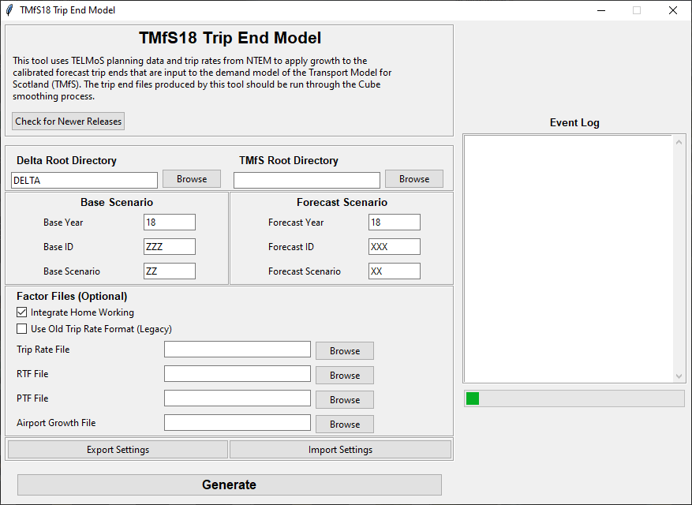

# Programming Overview

## Overview

The main component of the TMfS18 Trip End Model is coded in Python. This
section describes the coding of the program in Python.

The Trip End Model was coded in Python version 3.7.5 and any updates or
amendments to the software should be undertaken using this, or a later a
version of the software.

## Coding

The main function of the Python files are as follows:

- `TELMoS_main.py` - replaces the "main" sub-routine in the TMfS14 VB
  code which calculates the new TMfS trip ends. The methodology is as
  follows:
    - Read in all "Factors" and "Delta" files to the expected format;
    - Calculate attraction factors and attraction growth factors;
    - Calculate production factors and production growth factors;
    - Read in the pivot year TMfS calibrated trip ends (`*.CTE` and `*.TOD`);
    - Add in the airport growth;
    - Combine the NTEM purposes to TMfS purposes; and
    - Create and write out the new TMfS trip ends (`*.CTE` and `*.TOD`).
- `TELMoS_goods.py` - replaces the "goods" sub-routine in the TMfS14 VB
  code which calculates the new trip ends for goods vehicles. The
  methodology is as follows:
    - Read in the goods "Delta" files;
    - Read in the pivot year goods matrices;
    - Create forecast commodity matrices; and
    - Create and write forecast TMfS goods vehicle trip end files.
- `TELMoS_addins.py` - replaces the "addins" sub-routine in the TMfS14
  VB code which calculates the new trip ends for external zones. The
  methodology is as follows:
    - Read in the pivot year add-in matrices;
    - Read in and apply the NRTF factors; and
    - Create and write forecast TMfS add in trip end files.
- `TELMoS_script.py` - is the script that can be run from command-line
  for a full run of each part of the Trip End Model;
- `gui.py` and `widget_templates.py` - creates a graphical user interface
  to enter the arguments for the Trip End Model and show a log of the
  process; and
- `data_functions.py` - other functions used in the process.

## Graphical User Interface

The GUI in-use will look similar to the following:

Options that have not been discussed in the previous sections include:

- Export/Import Settings - allows the user to save and load all
  settings in the GUI;
- Integrate Home Working - if selected, the population data and trip
  rate data will be expected with the WAH/WBC split discussed in the
  "TELMoS Planning Data" section. Checked on by default;
- Use Old Trip Rate Format - Can be selected to use the previous
  format of production trip rates (separate files for each
  segmentation containing a matrix of trip rates by household/person
  type). Unchecked by default;
- RTF/PTF/Airport Factors File - Alternative location for factor
  files. If blank, will use the default versions in the 'Factors'
  folder; and
- Check for Newer Releases - opens the GitHub repository for the Trip
  End Model.
